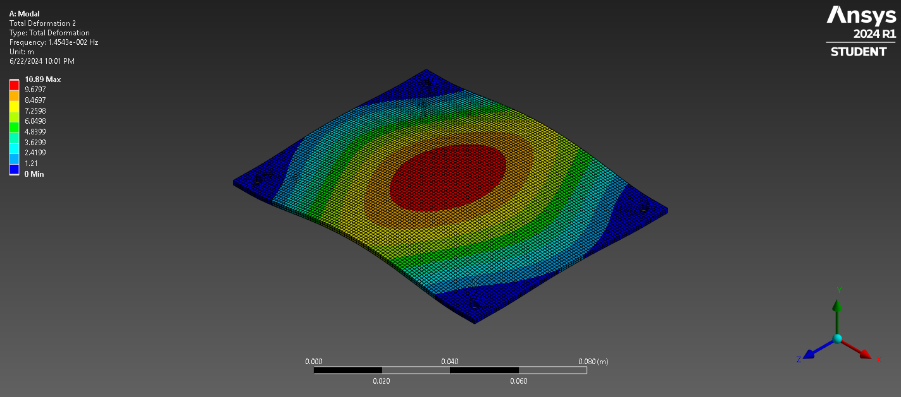
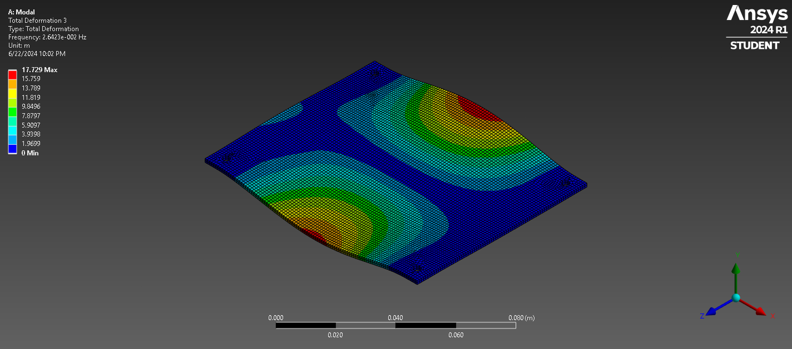
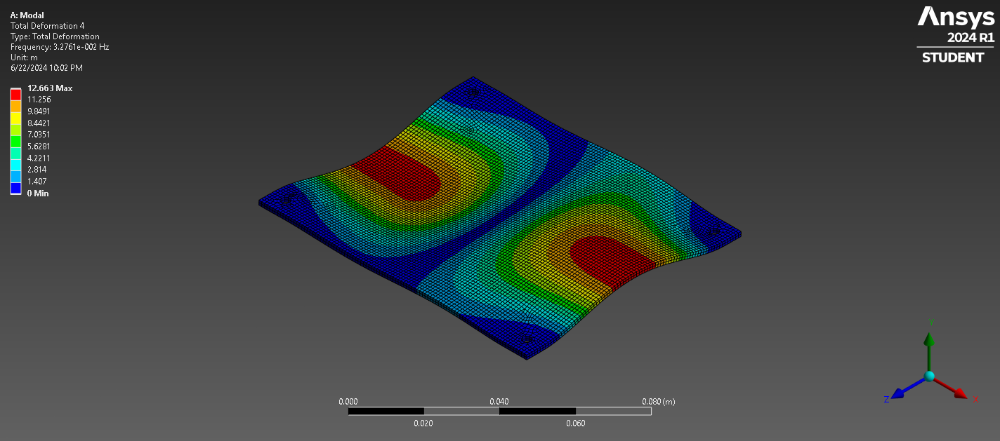
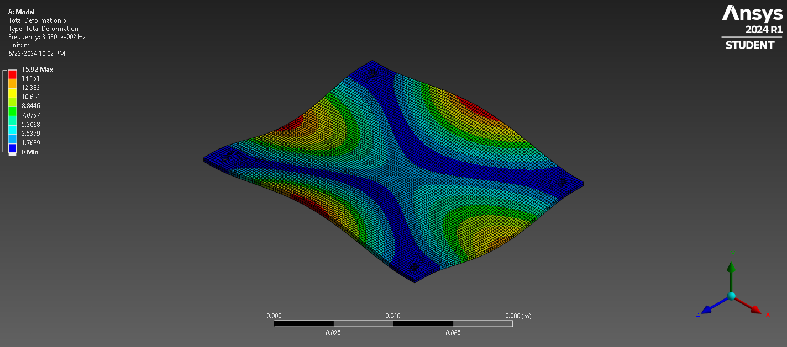
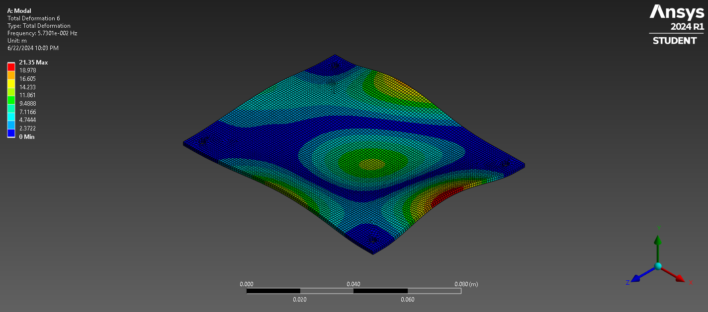
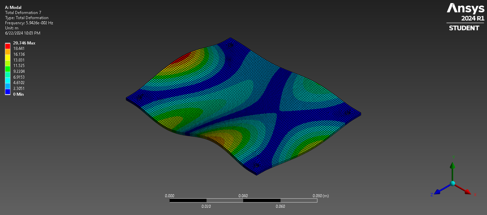

# PCB Modal Analysis Project

## Overview
This project involves a detailed modal analysis of a PCB (Printed Circuit Board) designed for high-stress environments, such as within a missile. The study aims to understand the natural frequencies and mode shapes of the PCB to ensure it can withstand vibrational loads and function reliably.

## Project Summary
I conducted a comprehensive modal analysis of a PCB using Ansys Workbench. The PCB was initially modeled in Fusion 360, including all mounting holes, pads, and traces, and then exported to Ansys as a STEP file. The analysis involved defining the material properties, meshing the model, and applying boundary conditions to simulate real-world constraints. The modal analysis identified the natural frequencies and mode shapes of the PCB, which are crucial for predicting its behavior under dynamic loading conditions and ensuring its reliability in defense applications.

### Key Engineering Properties and Methods:
- **Material Properties**: 
  - FR-4 Epoxy (PCB substrate)
  - Copper (traces)
- **Boundary Conditions**: Fixed supports at the inner faces of the four mounting holes.
- **Analysis Methods**: Finite Element Analysis (FEA) for determining mode shapes and natural frequencies.

### Skills Demonstrated:
- **Systems Integration**: Integration of software (Fusion 360 and Ansys Workbench) for comprehensive analysis.
- **Mathematical Problem-Solving**: Application of FEA techniques to solve complex engineering problems.
- **Effective Communication**: Clearly documented and visualized analysis results for technical audiences.

## Mode Shapes
Below are the images of the mode shapes identified during the analysis, which highlight the deformation patterns and critical stress points in the PCB:

### Mode Shape 1

### Mode Shape 2

### Mode Shape 3

### Mode Shape 4

### Mode Shape 5

### Mode Shape 6

## Files in the Repository
- **FR4_Circuit_Board_with_Copper_Pads_and_Traces.step**: STEP file of the PCB model.
- **modal_analysis_report.pdf**: Detailed report of the modal analysis.
- **mode_shape_1.png**: Image of the first mode shape.
- **mode_shape_2.png**: Image of the second mode shape.
- **mode_shape_3.png**: Image of the third mode shape.
- **mode_shape_4.png**: Image of the fourth mode shape.
- **mode_shape_5.png**: Image of the fifth mode shape.
- **mode_shape_6.png**: Image of the sixth mode shape.
- **README.md**: This README file.

## How to Use
1. **Review the STEP file** for the PCB geometry.
2. **Open the HTML report** for a detailed analysis and results.
3. **Examine the mode shape images** to understand the vibrational characteristics of the PCB.

### Practical Application
The results from this modal analysis can be directly applied to optimize the design of PCBs used in defense applications, ensuring they can endure high vibrational stresses and maintain operational integrity under extreme conditions. This analysis is essential for developing robust and reliable defense technology components.

Feel free to reach out if you have any questions or need further information about this project.
